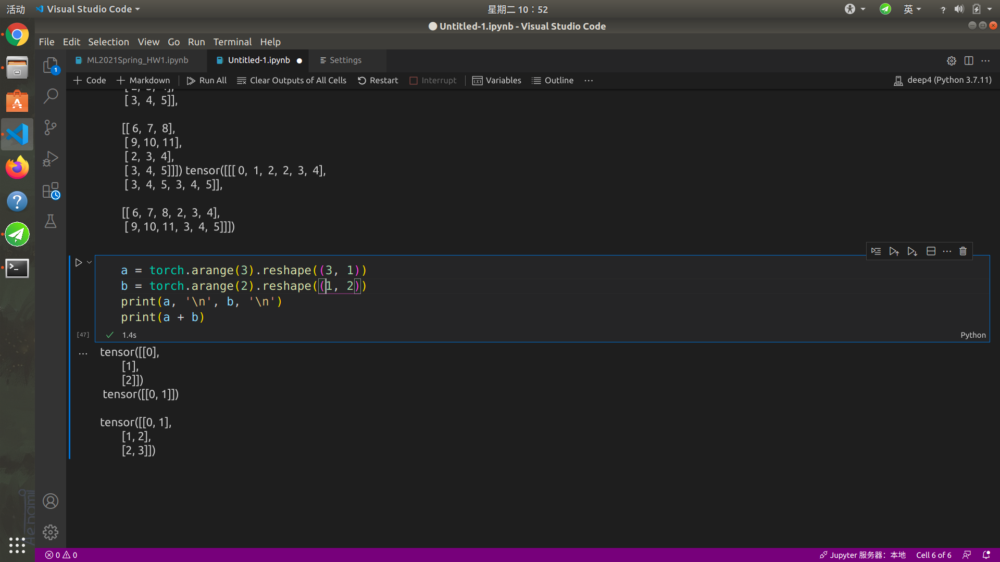

**vscode使用jupyter**
  ```
  until now, I find that it can be used normally with python=3.7,  torch=1.51, of course it is just served as a kernel or a environment.    
   and if you want to creat one jupyter notebook, pressing 'crtl + shift + P', then input jupyter in the search-box and choose create new jupyter notebook.  
  ```
  ```python
  a = 5  
  b = a
  ```  
  
 you find in the jupyter, it is working  
 
 ***torch.tensor***  
 to say someting about the dimension of the tensor, franking speaking, I am really confused about this.
 
 ```python
x = x.reshape([2, 2, 3])
x
y = torch.tensor([[[2, 3, 4], [3, 4, 5]], [[2, 3, 4], [3, 4, 5]]])
y
print(torch.cat((x, y), dim=0),
torch.cat((x, y), dim=1),
torch.cat((x, y), dim=2))
```
the output is like this
   
 
  **所以第一个括号里面是行，第二个括号里面是列，第三个括号里面是dim3**  
  
  **数据操作与实现 1.2**
  注意`广播机制`，对于两个tensor，如若大小不一致，会直接通过复制补全从而相加
  ```python
  a = torch.arange(3).reshape((3, 1))
b = torch.arange(2).reshape((1, 2))
print(a, '\n', b, '\n')
print(a + b)
```
  
